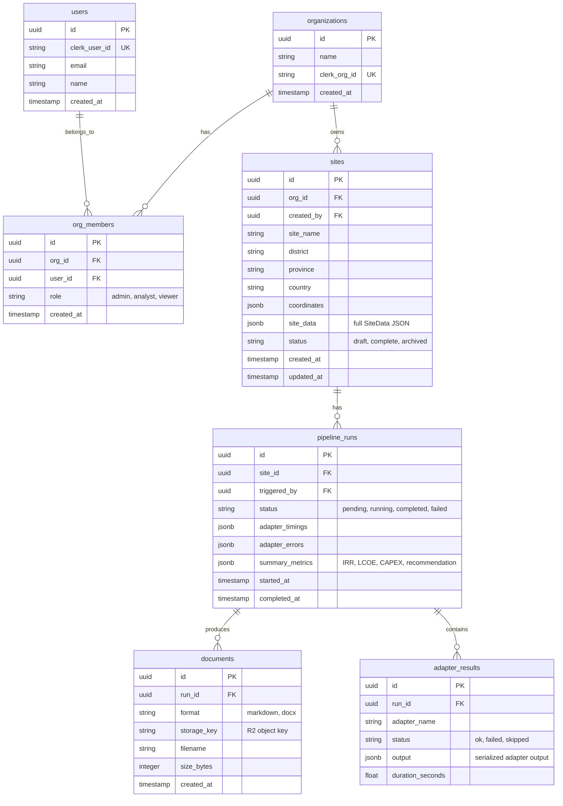

# Deployable Web Platform for Minigrid PFS Generation

## Overview

Turn the working CLI prototype (7 adapters, 16-section PFS generation, ~6s pipeline) into a production web platform where multiple organizations can create sites, run the computational pipeline, and download PFS documents (Markdown + DOCX). The existing Python adapter logic, data models, and Jinja templates are preserved as-is and wrapped in a FastAPI backend. A Next.js frontend provides a multi-step form wizard for site data entry, real-time pipeline progress, and document management.

## Problem Statement

The CLI prototype proves the computation works — `python run.py --site sites/megaza.json` produces a complete PFS in 6 seconds. But it requires:
- A developer to construct JSON by hand
- Command-line access to run the pipeline
- Manual file management for outputs

This limits the tool to a single technical operator. The target users — energy consultants, NGO programme managers, mini-grid developers across multiple organizations — need a browser-based experience where they can enter site data through guided forms, run the analysis, and download professional documents.

## Proposed Solution

A two-service architecture:

```
┌─────────────────────────────────────────────────────────┐
│  Next.js 15 Frontend (Vercel)                           │
│  ┌──────────┐ ┌──────────┐ ┌──────────┐ ┌───────────┐  │
│  │ Auth     │ │ Site     │ │ Pipeline │ │ Document  │  │
│  │ (Clerk)  │ │ Wizard   │ │ Progress │ │ Viewer    │  │
│  └──────────┘ └──────────┘ └──────────┘ └───────────┘  │
│  Route Handlers (BFF proxy to FastAPI)                  │
├─────────────────────────────────────────────────────────┤
│  FastAPI Backend (Railway)                              │
│  ┌──────────┐ ┌──────────┐ ┌──────────┐ ┌───────────┐  │
│  │ Auth     │ │ Site     │ │ Pipeline │ │ Document  │  │
│  │ Verify   │ │ CRUD     │ │ Runner   │ │ Storage   │  │
│  └──────────┘ └──────────┘ └──────────┘ └───────────┘  │
│  Existing: Orchestrator → 7 Adapters → PFS Generator   │
├─────────────────────────────────────────────────────────┤
│  PostgreSQL (Neon)  │  Cloudflare R2 (documents)        │
└─────────────────────────────────────────────────────────┘
```

## Technical Approach

### Architecture

**Frontend: Next.js 15 + React 19 on Vercel**
- App Router with Route Handlers as BFF proxy (hides FastAPI URL, attaches Clerk tokens server-side)
- Clerk for authentication with built-in `<OrganizationSwitcher />` and RBAC
- Multi-step form wizard (7 steps) with client-side validation and draft auto-save
- SSE listener for real-time pipeline progress
- Tailwind CSS + shadcn/ui for component library

**Backend: FastAPI on Railway**
- Layered architecture: routes → services → existing computation core
- Pydantic v2 schemas mirroring the existing `SiteData` dataclass
- JWT validation via Clerk JWKS (no session sharing)
- SSE endpoint for pipeline progress streaming
- `asyncio.to_thread()` for CPU-bound adapter execution (~6s)
- SQLAlchemy 2.0 + Alembic for database migrations
- boto3 (S3-compatible) for R2 document uploads
- Presigned URLs for document downloads (15-minute TTL)

**Database: PostgreSQL (Neon)**



**File Storage: Cloudflare R2**
- Generated DOCX and Markdown uploaded after pipeline completion
- Presigned download URLs returned to frontend (15-min TTL)
- Organized by: `{org_id}/{site_id}/{run_id}/{filename}`

### API Design

```
# Auth (handled by Clerk — no custom endpoints)

# Sites
POST   /api/v1/sites                    Create site (accepts full SiteData JSON)
GET    /api/v1/sites                    List sites for current org
GET    /api/v1/sites/{id}               Get site details
PUT    /api/v1/sites/{id}               Update site data
DELETE /api/v1/sites/{id}               Archive site
POST   /api/v1/sites/{id}/duplicate     Clone a site

# Pipeline
POST   /api/v1/sites/{id}/run           Trigger pipeline run
GET    /api/v1/sites/{id}/runs           List runs for a site
GET    /api/v1/runs/{id}                Get run details + metrics
GET    /api/v1/runs/{id}/stream         SSE: pipeline progress events
POST   /api/v1/runs/{id}/retry          Re-run failed pipeline

# Documents
GET    /api/v1/runs/{id}/documents      List documents for a run
GET    /api/v1/documents/{id}/download  Get presigned download URL
```

### Frontend Pages

```
/                           Landing / dashboard
/sign-in                    Clerk sign-in
/sign-up                    Clerk sign-up
/org                        Organization settings
/sites                      Site list (table with status, last run, metrics)
/sites/new                  Multi-step form wizard (create)
/sites/[id]/edit            Multi-step form wizard (edit)
/sites/[id]                 Site detail: runs history, latest metrics
/sites/[id]/runs/[runId]    Run detail: adapter results, metrics, download
```

### Multi-Step Form Wizard (7 Steps)

| Step | Fields | Validation |
|---|---|---|
| 1. Site Identity | site_name, district, province, country, coordinates (map picker), developer | Name required, valid coordinates |
| 2. Settlement | population, mapped_structures, settlement_radius_m, terrain, access_description | Population > 0 |
| 3. Customers | Dynamic list: category, sub_type, count, tier. Add/remove rows | At least 1 segment, count > 0 |
| 4. Anchor Loads | Dynamic list: load_type (dropdown), name, count, estimated_load_kw, operating_hours, load_shape | Optional but validated if present |
| 5. Grid & E&S | grid_status, grid_arrival_evidence fields, protected_area_overlap, flood_risk, biodiversity_risk, ifc_category | Conditional: if grid_extension_planned, show timeline/funding fields |
| 6. Financial | tariff_scenarios, discount_rate, inflation_rate, fx_rate, financing_structure (grant/debt/equity %), debt terms | Financing % must sum to 1.0, rates 0-1 range, tariffs > 0 |
| 7. Review & Run | Read-only summary of all steps, JSON preview toggle, "Run Pipeline" button | All required fields complete |

**Draft auto-save:** Each step saves to the `sites` table with `status: "draft"` on blur/step-change. Users can leave and resume. Browser crash recovers from last saved step.

**Coordinate picker:** Leaflet/Mapbox map with click-to-place marker. Reverse geocode to auto-fill district/province.

### Pipeline Execution Flow

```
User clicks "Run Pipeline"
  → POST /api/v1/sites/{id}/run
  → Backend creates pipeline_run record (status: pending)
  → Returns run_id immediately (202 Accepted)
  → Frontend opens SSE connection: GET /api/v1/runs/{id}/stream

Backend (in background thread via asyncio.to_thread):
  → Loads SiteData from sites.site_data JSON
  → Builds adapter registry (same as CLI)
  → Runs orchestrator with progress callbacks
  → For each adapter completion:
    → Saves adapter_result to DB
    → Pushes SSE event: { adapter: "solar_resource", status: "ok", time: 3.5 }
  → On pipeline complete:
    → Runs PFS generator (Markdown + DOCX)
    → Uploads documents to R2
    → Saves document records to DB
    → Pushes SSE event: { status: "completed", documents: [...], metrics: {...} }
  → On failure:
    → Pushes SSE event: { status: "failed", error: "..." }
    → Partial results still saved and downloadable

Frontend SSE handler:
  → Updates progress bar (7 adapters + 1 generation step = 8 steps)
  → Shows adapter status chips (pending → running → ok/failed)
  → On complete: shows metrics summary + download buttons
  → On failure: shows which adapters failed, offers retry
```

### Input Validation (Critical — from SpecFlow Analysis)

The CLI accepts raw JSON with no bounds checking. The web platform must validate at both frontend (immediate feedback) and backend (security) layers:

| Field | Validation Rule | Error on Violation |
|---|---|---|
| coordinates | lat: -90 to 90, lon: -180 to 180 | "Invalid coordinates" |
| population | > 0, integer | "Population must be positive" |
| customer.count | > 0, integer | "Customer count must be positive" |
| financing_structure values | Each 0-1, sum = 1.0 (within 0.01 tolerance) | "Financing split must sum to 100%" |
| discount_rate | 0 < x < 1 | "Discount rate must be between 0% and 100%" |
| tariff values | > 0 | "Tariff must be positive" |
| debt_tenor_years | > 0, integer | "Debt tenor must be positive" |
| debt_interest_rate | 0 < x < 1 | "Interest rate must be between 0% and 100%" |
| settlement_radius_m | 100 to 50000 | "Settlement radius must be 100m-50km" |

Backend enforces all validation via Pydantic validators. Frontend mirrors in Zod schemas for instant feedback.

### Implementation Phases

#### Phase 1: Backend API Foundation (3-4 days)

**Goal:** FastAPI service wrapping existing computation, deployable to Railway.

**Tasks:**

1.1. **Project scaffold** — `backend/` directory with FastAPI app
- `backend/app/main.py` — FastAPI app with CORS, lifespan
- `backend/app/core/` — Symlink or copy existing `src/` computation modules
- `backend/app/schemas/` — Pydantic v2 models mirroring SiteData, adapter outputs
- `backend/app/api/routes/` — sites.py, runs.py, documents.py
- `backend/app/services/` — pipeline_service.py, document_service.py
- `backend/app/db/` — models.py (SQLAlchemy), session.py, migrations/
- `backend/app/dependencies/` — auth.py (Clerk JWT verify), tenant.py
- `backend/requirements.txt` — fastapi, uvicorn, sqlalchemy, alembic, boto3, pyjwt, python-docx, etc.
- `backend/Dockerfile`

1.2. **Database setup** — SQLAlchemy models + Alembic initial migration
- organizations, users, org_members, sites, pipeline_runs, adapter_results, documents
- Neon PostgreSQL provisioned

1.3. **Site CRUD endpoints** — POST/GET/PUT/DELETE with org-scoping
- Pydantic schema with full SiteData validation (all rules from table above)
- `site_data` stored as JSONB in the sites table
- Tenant-scoped: all queries filter by `org_id` from auth context

1.4. **Pipeline runner service** — wraps existing Orchestrator
- `pipeline_service.py`: loads SiteData from DB, builds registry, runs orchestrator
- Runs in `asyncio.to_thread()` to avoid blocking the event loop
- Saves adapter_results and summary_metrics to DB on completion
- Progress callback mechanism for SSE

1.5. **SSE progress endpoint** — `GET /api/v1/runs/{id}/stream`
- StreamingResponse with text/event-stream
- Events: adapter_start, adapter_complete, adapter_failed, pipeline_complete

1.6. **Document generation + R2 upload**
- After pipeline completes, run PFS generator
- Upload Markdown + DOCX to Cloudflare R2
- Save document records to DB
- Presigned URL endpoint for downloads

1.7. **Auth middleware** — Clerk JWT verification
- Decode JWT, extract org_id and user_id
- FastAPI dependency `get_current_user()` and `get_current_org()`
- Role-based access: admin (all), analyst (CRUD + run), viewer (read + download)

1.8. **Docker + Railway deployment**
- Dockerfile with Python 3.11+, uvicorn
- `railway.toml` configuration
- Environment variables: DATABASE_URL, CLERK_SECRET_KEY, R2 credentials

**Success criteria:**
- [ ] `POST /api/v1/sites` accepts full SiteData JSON, validates, saves to DB
- [ ] `POST /api/v1/sites/{id}/run` triggers pipeline, SSE streams progress
- [ ] Documents downloadable via presigned URL after pipeline completion
- [ ] All endpoints org-scoped via Clerk JWT
- [ ] Deployed and reachable on Railway

---

#### Phase 2: Frontend Foundation (3-4 days)

**Goal:** Next.js app with auth, site list, and basic CRUD — deployed to Vercel.

**Tasks:**

2.1. **Project scaffold** — `frontend/` directory
- `npx create-next-app@latest frontend --ts --tailwind --app --src-dir`
- Install: `@clerk/nextjs`, `shadcn/ui`, `zod`, `react-hook-form`, `@tanstack/react-query`
- `frontend/src/app/` — App Router pages
- `frontend/src/lib/` — API client, types, validation schemas
- `frontend/src/components/` — UI components

2.2. **Clerk integration**
- `<ClerkProvider>` in root layout
- Sign-in / sign-up pages
- `<OrganizationSwitcher />` in navbar
- Middleware protecting all routes except landing

2.3. **API client layer**
- `frontend/src/app/api/[...proxy]/route.ts` — BFF proxy to FastAPI
- Attaches Clerk token to backend requests
- Shared TypeScript types generated from Pydantic schemas (or manually mirrored)

2.4. **Dashboard page** — `/sites`
- Table: site name, district, country, status, last run date, recommendation, actions
- Filters: status (draft/complete/archived), country
- "New Site" button

2.5. **Site detail page** — `/sites/[id]`
- Site summary card with key info
- Run history table with status, metrics, download links
- "Edit" and "Run Pipeline" buttons

2.6. **Vercel deployment**
- Connect GitHub repo
- Environment variables: CLERK keys, backend API URL
- Preview deployments for branches

**Success criteria:**
- [ ] Users can sign up, create org, sign in
- [ ] Dashboard shows sites for current org
- [ ] Site detail page shows run history
- [ ] Deployed and accessible on Vercel

---

#### Phase 3: Form Wizard + Pipeline UX (4-5 days)

**Goal:** Complete multi-step form wizard and pipeline execution experience.

**Tasks:**

3.1. **Form wizard shell** — `/sites/new` and `/sites/[id]/edit`
- Step indicator (1-7) with progress bar
- Back/Next navigation with per-step validation
- Draft auto-save on step change (debounced PUT to /api/v1/sites/{id})
- `react-hook-form` + `zod` for validation
- Shared between create and edit flows

3.2. **Step 1: Site Identity**
- Text inputs: site_name, district, province, country, developer
- Coordinate picker: Leaflet map with click-to-place marker
- Reverse geocode on marker placement (OpenStreetMap Nominatim)

3.3. **Step 2: Settlement**
- Number inputs: population, mapped_structures, settlement_radius_m
- Dropdown: terrain (flat/rolling/hilly/mountainous)
- Textarea: access_description
- Optional: economic_activities, social_services as tag inputs

3.4. **Step 3: Customers**
- Dynamic table with add/remove rows
- Per row: category (dropdown), sub_type (conditional dropdown), count (number), tier (dropdown)
- Preset buttons: "Typical rural", "Peri-urban" to pre-fill common segmentations
- Running total shown

3.5. **Step 4: Anchor Loads**
- Dynamic table with add/remove rows
- Per row: load_type (dropdown with icons), name, count, estimated_load_kw (optional), load_shape (auto-selected from load_type)
- Preset: "Common anchors" button adds hospital + school + admin

3.6. **Step 5: Grid & E&S**
- Grid section: grid_status dropdown, conditional grid_arrival_evidence fields
- E&S section: toggle/dropdown for protected_area, flood_risk, biodiversity_risk, ifc_category

3.7. **Step 6: Financial Assumptions**
- Tariff scenarios: low/base/high with number inputs
- Financing structure: three sliders or inputs that must sum to 100%
- Debt terms: interest rate, tenor
- Rates: discount, inflation, FX
- "Use defaults" button to reset to standard values

3.8. **Step 7: Review & Run**
- Accordion sections summarizing all steps (read-only)
- "Edit" link on each section to jump back
- JSON preview toggle (for power users)
- "Run Pipeline" button (disabled if validation errors exist)

3.9. **Pipeline progress UI**
- Modal or inline panel after clicking "Run Pipeline"
- 8-step progress tracker (7 adapters + document generation)
- Each adapter: pending → running (spinner) → done (check) / failed (X)
- Real-time via SSE connection
- On complete: metrics summary card (PV kWp, CAPEX, IRR, LCOE, recommendation badge)
- Download buttons: Markdown, DOCX
- On failure: which adapters failed, error details, "Retry" button

3.10. **Document viewer**
- Rendered Markdown preview in-browser (read-only)
- DOCX download via presigned URL
- "Compare with previous run" link if multiple runs exist

**Success criteria:**
- [ ] Complete wizard flow: create site → fill all 7 steps → run pipeline → see results → download
- [ ] Draft auto-save works across browser refresh
- [ ] Pipeline progress shows real-time adapter status via SSE
- [ ] Validation prevents invalid data at every step
- [ ] Edit flow pre-populates all fields from saved site data

---

#### Phase 4: Multi-Tenancy, Roles & Polish (2-3 days)

**Goal:** Production-ready access control, org management, and UX polish.

**Tasks:**

4.1. **Organization management page** — `/org`
- Invite members by email (Clerk invitations)
- Role assignment: admin, analyst, viewer
- Member list with role badges

4.2. **Role-based UI**
- Viewers: can browse sites and download documents, no edit/run buttons
- Analysts: full CRUD + run
- Admins: org settings + member management + all analyst permissions

4.3. **Site duplication** — "Clone Site" action
- Copies site_data to new site with "(Copy)" suffix
- Useful for testing variants (different tariffs, financing structures)

4.4. **Document versioning**
- Run history on site detail page shows all past runs with timestamps
- Each run has its own documents — no overwriting
- "Compare" view: side-by-side metrics from two runs

4.5. **Error handling & edge cases**
- PVGIS API timeout: show "Using fallback solar data" warning in results
- Concurrent run prevention: disable "Run" if a run is already in progress for this site
- Partial pipeline results: allow download of partial PFS with DATA GAP markers
- Empty customer list: block at validation, not at pipeline runtime

4.6. **Loading states, empty states, toasts**
- Skeleton loaders for tables and cards
- Empty state illustrations for "No sites yet", "No runs yet"
- Toast notifications for save/run/error events

4.7. **Responsive layout**
- Wizard works on tablet (min 768px)
- Dashboard readable on mobile
- Document viewer scrollable on all sizes

**Success criteria:**
- [ ] Org admin can invite members with specific roles
- [ ] Viewer role cannot edit or run pipelines
- [ ] Multiple runs preserved per site with comparison
- [ ] Graceful handling of all error states from SpecFlow analysis

---

#### Phase 5: Deployment, Monitoring & Launch (1-2 days)

**Goal:** Production deployment with monitoring and documentation.

**Tasks:**

5.1. **Production deployment checklist**
- Frontend: Vercel production deployment, custom domain
- Backend: Railway production service, health check endpoint
- Database: Neon production branch, connection pooling
- R2: Production bucket with lifecycle rules

5.2. **Environment configuration**
- Secrets management via platform env vars (Vercel/Railway)
- CORS: restrict to frontend domain
- Rate limiting: 10 pipeline runs per org per hour

5.3. **Monitoring**
- Backend: structured logging (JSON), health endpoint
- Sentry for error tracking (both frontend and backend)
- Pipeline run metrics: duration, success rate, adapter failure frequency

5.4. **Documentation**
- README with architecture overview and local dev setup
- API documentation (FastAPI auto-generates OpenAPI/Swagger)
- User guide: how to create a site and generate a PFS

**Success criteria:**
- [ ] Platform accessible at production URL
- [ ] Health checks passing on Railway
- [ ] Error tracking operational
- [ ] First real user can create account → create site → generate PFS → download DOCX

---

## Alternative Approaches Considered

| Approach | Pros | Cons | Decision |
|---|---|---|---|
| **Django full-stack** | Single language, built-in admin, ORM | No React ecosystem, server-rendered forms less interactive | Rejected: wizard UX requires rich client-side interactivity |
| **Supabase Auth** | Tight DB integration, row-level security | Couples auth to DB provider, no built-in org management UI | Rejected: Clerk's `<OrganizationSwitcher />` eliminates weeks of multi-tenant UI work |
| **WebSockets for progress** | Bidirectional | Overkill for unidirectional updates, more infra complexity | Rejected: SSE is simpler and sufficient for progress streaming |
| **Celery for background jobs** | Retry, scheduling, queue management | Requires Redis, overkill for 6-second jobs | Rejected: `asyncio.to_thread()` is sufficient at this duration |
| **Stream DOCX through API** | Simpler (no R2) | Ties up API server during download, no caching | Rejected: presigned URLs offload bandwidth to R2 |

## System-Wide Impact

### Interaction Graph

User action → Clerk auth → Next.js Route Handler (BFF) → FastAPI endpoint → Pydantic validation → Service layer → Orchestrator → 7 Adapters (sequential DAG) → PFS Generator → R2 upload → DB writes → SSE event push → Frontend state update.

### Error & Failure Propagation

- **Clerk token expired:** Next.js middleware redirects to sign-in. No backend call made.
- **Pydantic validation failure:** FastAPI returns 422 with field-level errors. Frontend displays inline.
- **Adapter failure:** Orchestrator catches exception, records error, continues to next adapter. Pipeline completes with partial results. SSE pushes adapter failure event. PFS generated with DATA GAP markers.
- **PVGIS API timeout:** Solar adapter falls back to hardcoded values. Warning added to results.
- **R2 upload failure:** Pipeline results saved to DB (not lost). Document download unavailable. User can retry.
- **Railway process crash:** Pipeline run stays in "running" status. Health check detects. Manual or cron cleanup sets to "failed" after 5-minute timeout.

### State Lifecycle Risks

- **Partial pipeline save:** If backend crashes mid-pipeline, some adapter_results exist but pipeline_run status stays "running". Mitigation: startup job marks stale "running" runs as "failed".
- **Orphaned R2 objects:** If document record fails to save after R2 upload. Mitigation: R2 lifecycle rule deletes objects older than 90 days without matching DB record (batch cleanup job).
- **Draft site with no run:** Valid state — user saved draft but didn't run. No cleanup needed.

## Acceptance Criteria

### Functional Requirements

- [ ] User can sign up, create organization, invite members with roles
- [ ] User can create a site via 7-step form wizard with validation
- [ ] User can run pipeline and see real-time progress (8 adapter steps)
- [ ] User can download generated PFS as Markdown and DOCX
- [ ] User can view run history and compare metrics across runs
- [ ] User can edit site data and re-run pipeline
- [ ] User can duplicate a site for variant analysis
- [ ] All data is org-scoped (users only see their org's sites)
- [ ] Viewer role can browse and download but not edit or run

### Non-Functional Requirements

- [ ] Pipeline execution completes in < 15 seconds (including document generation + upload)
- [ ] Form wizard auto-saves drafts within 2 seconds of field change
- [ ] Platform handles 10 concurrent pipeline runs without degradation
- [ ] All API endpoints return < 500ms (excluding pipeline execution)
- [ ] DOCX download via presigned URL completes in < 3 seconds

### Quality Gates

- [ ] All API endpoints have Pydantic request/response schemas
- [ ] Frontend form validation mirrors backend validation (Zod ↔ Pydantic)
- [ ] No secrets in client-side code
- [ ] CORS restricted to frontend domain in production

## Dependencies & Prerequisites

| Dependency | Purpose | Cost | Setup Time |
|---|---|---|---|
| **Clerk** | Auth + org management | Free (< 10K MAU) | 1 hour |
| **Neon** | PostgreSQL hosting | Free tier (0.5 GB) | 30 min |
| **Cloudflare R2** | Document storage | Free (< 10 GB/mo) | 30 min |
| **Railway** | FastAPI hosting | $5/mo (Hobby) | 30 min |
| **Vercel** | Next.js hosting | Free (Hobby) | 15 min |
| **Leaflet** | Map picker (OSS) | Free | Included in frontend |

Total infrastructure cost: **~$5/month** on free/hobby tiers. Scales with usage.

## Risk Analysis & Mitigation

| Risk | Likelihood | Impact | Mitigation |
|---|---|---|---|
| PVGIS API downtime | Medium | Low | Fallback data already implemented in solar adapter |
| Railway cold starts | Medium | Low | Health check pings keep service warm; or upgrade to Pro |
| Clerk vendor lock-in | Low | Medium | Auth is a thin layer; JWTs are standard. Migration to Better Auth if needed |
| Large concurrent load | Low | High | Rate limit pipeline runs per org; queue system (Celery + Redis) if needed later |
| Python 3.9 compatibility | Low | Low | Backend uses Python 3.11+ (Railway supports it). Existing code already has `from __future__ import annotations` |

## Project Structure

```
Minigrids/
├── frontend/                          # Next.js 15 app
│   ├── src/
│   │   ├── app/
│   │   │   ├── api/[...proxy]/route.ts     # BFF proxy
│   │   │   ├── sites/
│   │   │   │   ├── page.tsx                # Site list
│   │   │   │   ├── new/page.tsx            # Form wizard
│   │   │   │   └── [id]/
│   │   │   │       ├── page.tsx            # Site detail
│   │   │   │       ├── edit/page.tsx       # Edit wizard
│   │   │   │       └── runs/[runId]/page.tsx
│   │   │   ├── org/page.tsx                # Org settings
│   │   │   └── layout.tsx
│   │   ├── components/
│   │   │   ├── wizard/                     # Form wizard steps
│   │   │   ├── pipeline/                   # Progress UI
│   │   │   └── ui/                         # shadcn components
│   │   └── lib/
│   │       ├── api.ts                      # API client
│   │       ├── schemas.ts                  # Zod validation
│   │       └── types.ts                    # TypeScript types
│   ├── package.json
│   └── vercel.json
│
├── backend/                           # FastAPI app
│   ├── app/
│   │   ├── main.py
│   │   ├── api/routes/
│   │   │   ├── sites.py
│   │   │   ├── runs.py
│   │   │   └── documents.py
│   │   ├── services/
│   │   │   ├── pipeline_service.py
│   │   │   └── document_service.py
│   │   ├── schemas/
│   │   │   ├── site.py                     # Pydantic SiteData
│   │   │   └── run.py
│   │   ├── db/
│   │   │   ├── models.py                   # SQLAlchemy models
│   │   │   ├── session.py
│   │   │   └── migrations/
│   │   ├── dependencies/
│   │   │   ├── auth.py                     # Clerk JWT verify
│   │   │   └── tenant.py
│   │   └── core/                           # Existing computation
│   │       ├── adapters/                   # Existing 7 adapters
│   │       ├── models/                     # Existing dataclasses
│   │       ├── generator/                  # Existing PFS generator
│   │       ├── data/                       # Existing reference data
│   │       ├── registry.py
│   │       └── orchestrator.py
│   ├── requirements.txt
│   ├── Dockerfile
│   └── railway.toml
│
├── sites/                             # CLI site data (kept for reference)
├── src/                               # Original CLI code (preserved)
├── run.py                             # Original CLI entry point (preserved)
└── docs/
```

## Sources & References

### Internal References
- CLI entry point: `run.py` — pipeline flow to preserve
- Orchestrator: `src/orchestrator.py` — wrapping target
- Site data model: `src/models/site.py` — schema to mirror in Pydantic
- PFS generator: `src/generator/pfs_generator.py` — document generation logic
- Original plan: `docs/plans/2026-05-01-001-feat-minigrid-pfs-generation-platform-plan.md`

### External References
- Clerk Next.js quickstart: https://clerk.com/docs/quickstarts/nextjs
- FastAPI background tasks + SSE: https://fastapi.tiangolo.com/advanced/custom-response/#streamingresponse
- Cloudflare R2 S3-compatible API: https://developers.cloudflare.com/r2/api/s3/
- Neon serverless PostgreSQL: https://neon.tech/docs
- Railway deployment: https://docs.railway.com/guides/fastapi
- shadcn/ui components: https://ui.shadcn.com
